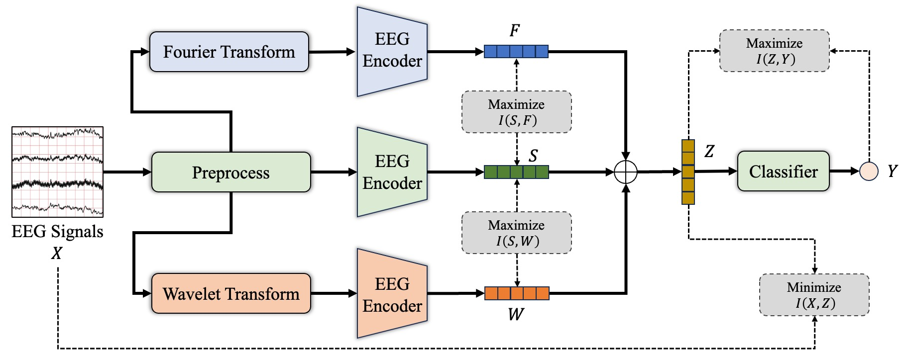

# IBEEG

Code implementation for **Deep Multiview Information Bottleneck Framework for Electroencephalography Recognition**.



## Requirements

```
conda create -n IBEEG python=3.9
conda activate IBEEG
pip install -r requirements.txt
```

## Dataset Preparation and Folder Structure

Download the datasets:
- [DREAMER](https://zenodo.org/records/546113), 
- [Simultaneous Task EEG Workload (STEW)](https://ieee-dataport.org/open-access/stew-simultaneous-task-eeg-workload-dataset),
- [ISRUC-SLEEP](https://sleeptight.isr.uc.pt/?page_id=76) 
- [Hinss2021](https://zenodo.org/records/4917218)
- [SEED-V Dataset](https://bcmi.sjtu.edu.cn/home/seed/seed-v.html) 

- [Lehner2021](https://www.research-collection.ethz.ch/handle/20.500.11850/458693)
- [Crowdsourced](https://osf.io/9bvgh/), or use the processed version in [EEG2Rep](https://github.com/Navidfoumani/EEG2Rep) with this [link](https://drive.google.com/drive/folders/1KQyST6VJffWWD8r60AjscBy6MHLnT184?usp=sharing)
- [TUAB & TUEV](https://isip.piconepress.com/projects/nedc/html/tuh_eeg/), 


Put them in the folder:
```
IBEEG/
    |_ *.py
    |_ README.md
    |_ requirements.txt
    |_ models/
        |_ [model_name].py
    |_ trainer/
        |_ train_[model_name].py
        |_ test.py
    |_ datasets/
        |_ preprocess_tuab.py
        |_ preprocess_tuev.py
        |_ preprocess_sleepedf.py
        |_ processed/
        |_ raw/
            |_ DREAMER/
                |_ DREAMER.mat
            |_ STEW Dataset/
                |_ *.txt
            |_ ISRUC-SLEEP/
                |_ Subgroup_1/
                    |_ 1/
                        |_ 1.rec
                        |_ 1.txt
            |_ ISRUC-mat/
                |_ Subgroup_1/
                    |_ *.mat
            |_ Hinss2021/
                |_ P01/
                    |_ S1/

            |_ BNCI2014001/
                |_ *.mat

            |_ SleepEDF/
                |_ sleep-edf-database-expanded-1.0.0/
                    |_ sleep-cassette/
            |_ SEED-V/
                |_ EEG_raw/
            |_ Crowsourced/
                |_ Raw Data/
            |_ TUAB/
                |_ edf/
                    |_ train/
                    |_ eval/
            |_ TUEV/
                |_ edf/
                    |_ train/
                    |_ eval/
            |_ Lehner2021/
                |_ Cybathlon_Data/
                    |_ Session [X]/
                        |_ aC/
                            |_ *.eeg
```

Preprocess for TUAB and TUEV datasets.
```
cd datasets/
python preprocess_tuab.py
python preprocess_tuev.py
```

## Usage

### For main experiment:
```
python main.py --dataset dreamer --overlap 0 --epochs 100 --lr 1e-4 --alpha 1e-3 --beta 1e-3 --device cuda:0

python main.py --dataset stew --overlap 0 --epochs 100 --lr 1e-4 --alpha 1e-3 --beta 1e-3 --device cuda:0 

python main.py --dataset isruc --epochs 100 --lr 5e-5 --alpha 1e-3 --beta 1e-4 --device cuda:0

python main.py --dataset hinss --epoch 100 --lr 5e-5 --alpha 1e-4 --beta 1e-4 --device cuda:0 
```


### For cross dataset evaluation:

- Train on dreamer and test in STEW:
```
python cross_dataset.py --dataset stew --epoch 10 --device cuda:0
```

- Train on STEW and test in DREAMER:
```
python cross_dataset.py --dataset dreamer --epoch 10 --device cuda:0
```